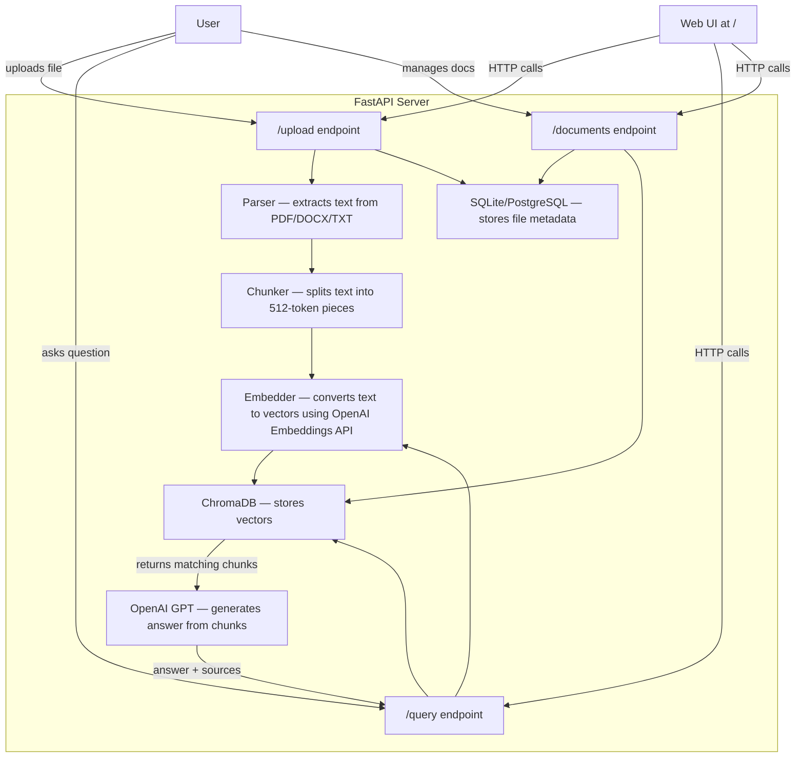

# LexoraAI

A RAG (Retrieval-Augmented Generation) system where you upload documents and ask questions about them. The system finds relevant parts from your documents and uses OpenAI to generate an answer based only on that content — so it doesn't make things up.

---

## How It Works (Simple Version)

```
You upload a PDF/DOCX/TXT
    → Text is extracted from the file
    → Text is split into small chunks
    → Each chunk is converted into a vector (embedding)
    → Vectors are stored in ChromaDB

You ask a question
    → Your question is converted into a vector
    → ChromaDB finds the most similar chunks
    → Those chunks + your question are sent to OpenAI
    → You get an answer with source references
```

---

## Architecture



This is the entire system. The FastAPI server handles everything — parsing, chunking, embedding, storing, searching, and generating answers. The web UI is a static HTML page served by the same server.

---

## File Structure

```
LexoraAI/
├── app/                        # All backend code lives here
│   ├── config.py               # Loads settings from .env (API keys, paths, etc.)
│   ├── database.py             # Database setup — tables, connection, models
│   ├── main.py                 # Entry point — creates the FastAPI app, serves frontend
│   ├── pipeline.py             # The core logic — parsing, chunking, embedding, search, answer generation
│   └── api/
│       ├── router.py           # Groups all API routes under /api/v1
│       ├── upload.py           # Handles file uploads and triggers processing
│       ├── query.py            # Takes a question, runs the RAG pipeline, returns answer
│       └── documents.py        # List, get, or delete uploaded documents
│
├── static/
│   └── index.html              # Web UI — chat interface + document management
│
├── tests/
│   └── test_pipeline.py        # 21 tests — covers parser, chunker, embedder, and API
│
├── requirements.txt            # Python packages needed
├── Dockerfile                  # Builds the app into a Docker container
├── docker-compose.yml          # Runs PostgreSQL + API together with Docker
├── render.yaml                 # One-click deploy to Render
├── .env.example                # Template — copy to .env and add your OpenAI key
├── postman_collection.json     # Import into Postman to test all API endpoints
├── pytest.ini                  # Test config
└── README.md
```

**What each key file does:**

- **`pipeline.py`** — This is the most important file. It has all the RAG logic: parsing documents, splitting into chunks, creating embeddings, storing in ChromaDB, searching, and calling OpenAI to generate answers.
- **`database.py`** — Sets up SQLite (local) or PostgreSQL (Docker) to store document metadata like filename, status, upload time, etc.
- **`config.py`** — Reads `.env` file and makes settings available to the rest of the app.
- **`main.py`** — Creates the FastAPI app, serves the web UI, sets up CORS, and connects everything on startup.
- **`static/index.html`** — A single-page web UI for uploading files and asking questions. No build step — just plain HTML/CSS/JS.

---

## API Endpoints

| Method | Endpoint | What it does |
|--------|----------|-------------|
| `GET` | `/api/v1/health` | Check if server is running |
| `POST` | `/api/v1/upload` | Upload PDF/DOCX/TXT files (up to 20 at once) |
| `POST` | `/api/v1/query` | Ask a question, get an answer with sources |
| `GET` | `/api/v1/documents` | List all uploaded documents |
| `GET` | `/api/v1/documents/{id}` | Get details of one document |
| `DELETE` | `/api/v1/documents/{id}` | Delete a document from everywhere |

---

## Tech Stack

| What | Tool | Why |
|------|------|-----|
| API | FastAPI | Fast, async, auto-generates docs |
| Database | SQLite (local) / PostgreSQL (Docker) | Stores document metadata |
| Vector store | ChromaDB | Stores and searches embeddings |
| Embeddings | OpenAI text-embedding-3-small | High quality, lightweight (no PyTorch needed) |
| LLM | OpenAI GPT-4o-mini | Generates answers from retrieved chunks |
| Doc parsing | PyMuPDF, python-docx | Reads PDF and DOCX files |
| Tokenizer | tiktoken | Counts tokens for chunking |
| Frontend | HTML/CSS/JS (static) | Zero dependencies, served by FastAPI |
| Tests | pytest | 21 tests, all passing |

---

## Configuration

All settings come from the `.env` file. Copy `.env.example` to `.env` and fill in your values:

| Variable | Default | What it is |
|----------|---------|-----------|
| `OPENAI_API_KEY` | — | **Required.** Your OpenAI key for answer generation |
| `DATABASE_URL` | `sqlite:///./local_data/lexora.db` | Database connection string |
| `CHROMA_PATH` | `./local_data/chroma` | Where ChromaDB stores vectors |
| `UPLOAD_DIR` | `./local_data/uploads` | Where uploaded files are saved |
| `EMBEDDING_MODEL` | `text-embedding-3-small` | Which OpenAI embedding model to use |
| `OPENAI_MODEL` | `gpt-4o-mini` | Which OpenAI model to use |
| `CHUNK_SIZE_TOKENS` | `512` | Tokens per chunk |
| `CHUNK_OVERLAP_TOKENS` | `50` | Overlap between chunks |
| `DEFAULT_TOP_K` | `5` | How many chunks to retrieve per query |

---

## Getting Started

### Clone the repo

```bash
git clone https://github.com/Dhanugupta0/Lexora-AI.git
cd Lexora-AI
```

### Local Setup

```bash
# Create virtual environment
python3 -m venv .venv
source .venv/bin/activate

# Install dependencies
pip install -r requirements.txt

# Set up environment
cp .env.example .env
# Open .env and add your OPENAI_API_KEY

# Start the server (API + UI)
PYTHONPATH=. uvicorn app.main:app --host 0.0.0.0 --port 8000 --reload
```

### Docker Setup

```bash
cp .env.example .env
# Add your OPENAI_API_KEY in .env

docker-compose up --build -d

# Check logs
docker-compose logs -f api
```

Docker uses PostgreSQL instead of SQLite. Everything else stays the same.

### Running Tests

```bash
PYTHONPATH=. pytest tests/ -v
# Expected: 21 passed
```

---

## How to Access

Once the server is running:

| What | URL |
|------|-----|
| **Web UI** (upload files, ask questions) | http://localhost:8000 |
| **API Docs** (Swagger — try endpoints directly) | http://localhost:8000/docs |
| **Health Check** | http://localhost:8000/api/v1/health |

Open http://localhost:8000 in your browser to start using the app. Upload a document, wait for it to process, then ask questions about it.

---

## Deploy on Render

### One-click deploy

1. Push your code to GitHub
2. Go to [Render Dashboard](https://dashboard.render.com/) and click **New > Blueprint**
3. Connect your GitHub repo — Render reads `render.yaml` and sets everything up
4. Add your `OPENAI_API_KEY` in the Render environment variables when prompted
5. Deploy — your app will be live at `https://lexora-ai.onrender.com`

### Manual deploy

1. Go to [Render Dashboard](https://dashboard.render.com/) and click **New > Web Service**
2. Connect your GitHub repo
3. Set **Runtime** to `Docker`
4. Add these environment variables:
   - `OPENAI_API_KEY` = your key
   - `DATABASE_URL` = `sqlite:////data/db/lexora.db`
   - `CHROMA_PATH` = `/data/chroma`
   - `UPLOAD_DIR` = `/data/uploads`
   - `EMBEDDING_MODEL` = `text-embedding-3-small`
5. (Optional) Add a **Persistent Disk** — mount at `/data`, 1 GB
6. Deploy

> **Note:** Free tier services spin down after 15 minutes of inactivity. First request after spin-down takes ~30 seconds.

---

**Built by Dhanu Gupta**
