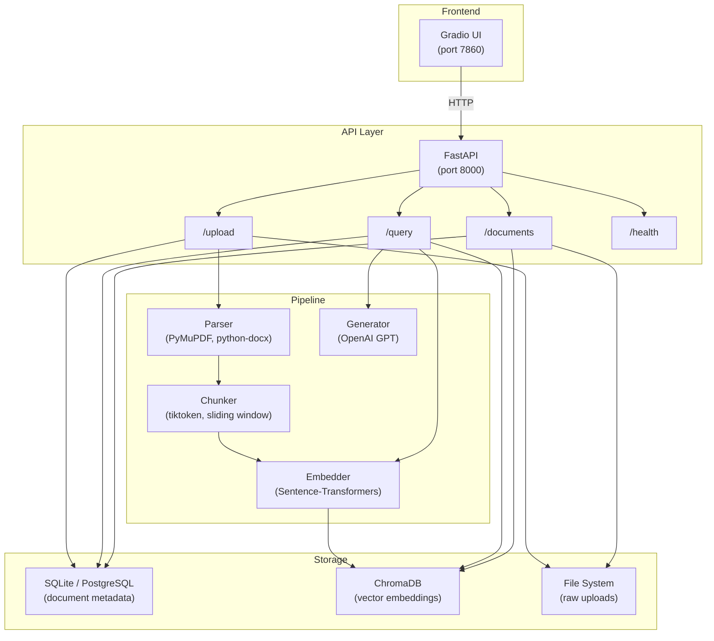
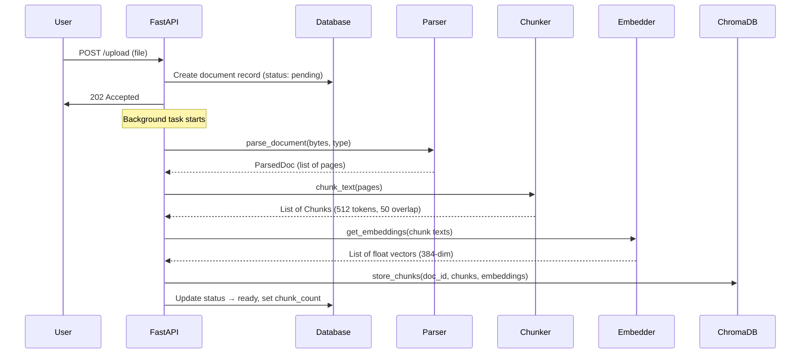
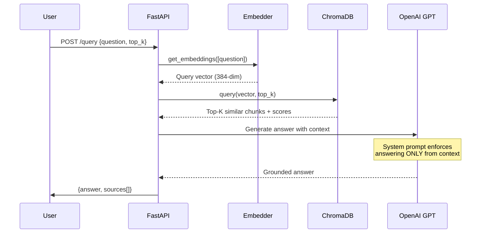
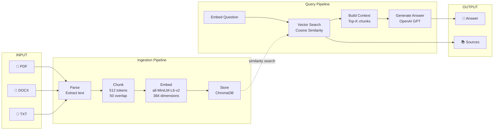
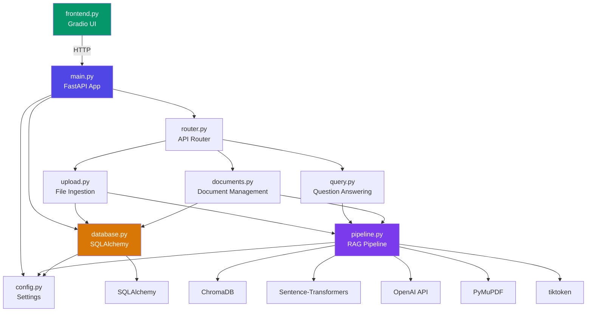
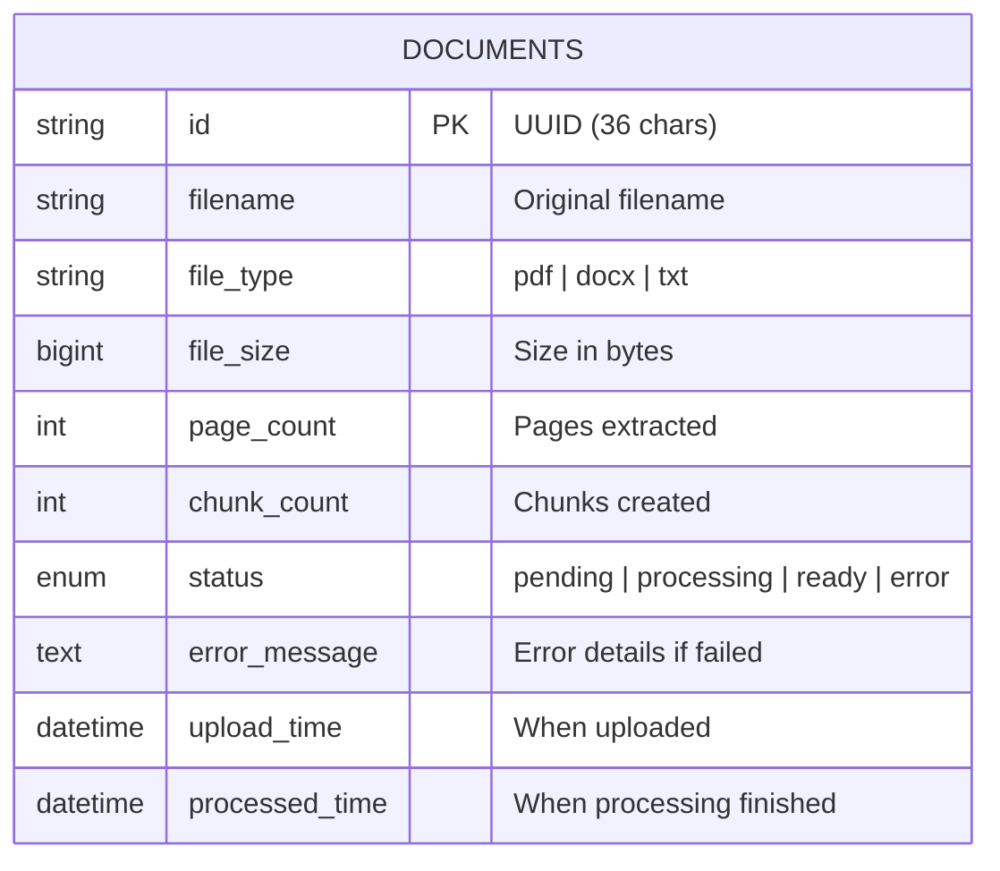
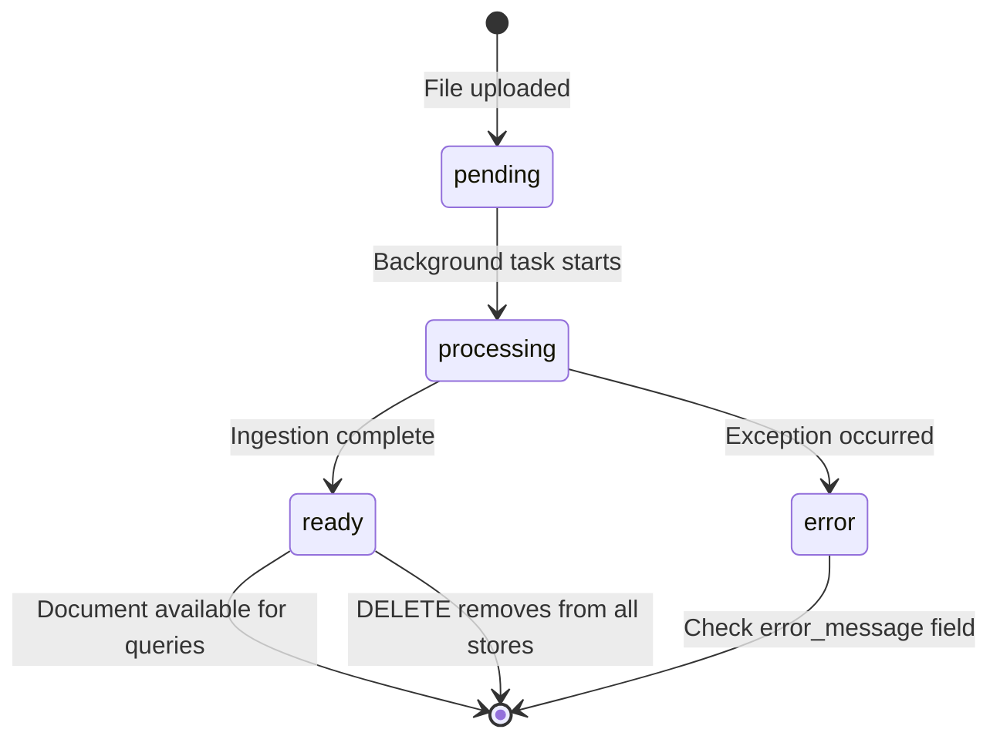
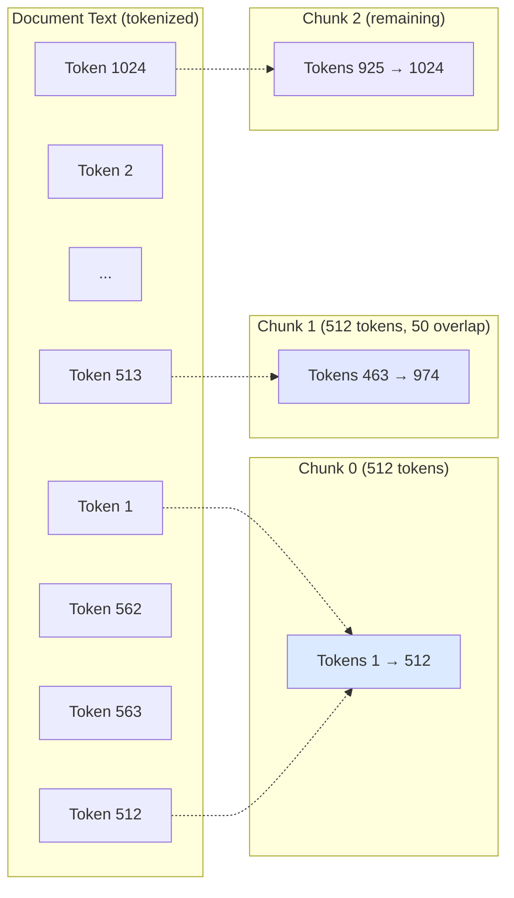
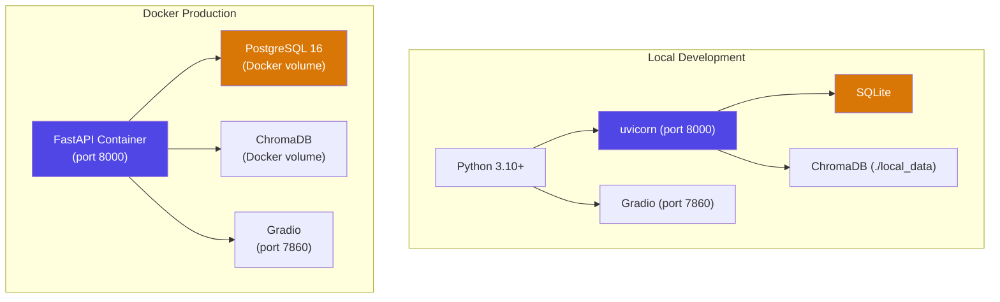

# ⚡ LexoraAI

A production-ready **Retrieval-Augmented Generation (RAG)** system that lets users upload documents, ask natural-language questions, and receive grounded answers backed by source citations.

Built with **FastAPI**, **ChromaDB**, **Sentence-Transformers**, and **OpenAI GPT** — deployable locally or via Docker in minutes.

---

## Table of Contents

- [What is RAG?](#what-is-rag)
- [Features](#features)
- [Tech Stack](#tech-stack)
- [Project Structure](#project-structure)
- [Architecture](#architecture)
- [How the Pipeline Works](#how-the-pipeline-works)
- [API Endpoints](#api-endpoints)
- [Getting Started](#getting-started)
  - [Local Setup](#local-setup)
  - [Docker Deployment](#docker-deployment)
- [Running Tests](#running-tests)
- [Configuration](#configuration)
- [Diagrams](#diagrams)

---

## What is RAG?

RAG (Retrieval-Augmented Generation) is a technique that improves LLM answers by first **retrieving** relevant content from a knowledge base, then **generating** a response grounded in that content. This eliminates hallucination because the LLM can only answer from the documents you provide.

```
Traditional LLM:  Question → LLM → Answer (may hallucinate)
RAG Pipeline:     Question → Search Documents → LLM + Context → Grounded Answer ✓
```

---

## Features

- **Multi-format document upload** — PDF, DOCX, and TXT files up to 50 MB each
- **Automatic text extraction** — PyMuPDF for PDFs, python-docx for DOCX, built-in for TXT
- **Token-aware chunking** — sliding window chunker with configurable size and overlap
- **Local embeddings** — Sentence-Transformers (all-MiniLM-L6-v2), no API key needed for embedding
- **Vector search** — ChromaDB with cosine similarity for fast semantic retrieval
- **LLM-powered answers** — OpenAI GPT generates answers using only retrieved context
- **Source citations** — every answer includes the exact chunks and pages used
- **Background processing** — documents are ingested asynchronously after upload
- **Gradio frontend** — clean chat UI with document management
- **REST API** — full Swagger/OpenAPI documentation at `/docs`
- **Docker-ready** — single `docker-compose up` for production deployment
- **21 unit + integration tests** — all passing

---

## Tech Stack

| Component | Technology | Purpose |
|-----------|-----------|---------|
| API Framework | FastAPI | REST API with async support |
| Database | SQLite (local) / PostgreSQL (Docker) | Document metadata storage |
| Vector Store | ChromaDB (embedded) | Stores and searches chunk embeddings |
| Embeddings | Sentence-Transformers | Converts text to vectors locally |
| LLM | OpenAI GPT-4o-mini | Generates answers from retrieved context |
| Document Parsing | PyMuPDF, python-docx | Extracts text from PDF and DOCX |
| Tokenizer | tiktoken | Token-accurate chunk splitting |
| Frontend | Gradio | Chat UI + document management |
| Testing | pytest | Unit and integration tests |

---

## Project Structure

```
LexoraAI/
├── app/
│   ├── __init__.py
│   ├── config.py            # Settings loaded from .env
│   ├── database.py          # SQLAlchemy models + engine (SQLite/PostgreSQL)
│   ├── main.py              # FastAPI app, CORS, lifespan startup
│   ├── pipeline.py          # Core RAG pipeline (parse → chunk → embed → store → search → generate)
│   └── api/
│       ├── __init__.py
│       ├── router.py        # Mounts all route modules under /api/v1
│       ├── upload.py        # POST /upload — file ingestion endpoint
│       ├── query.py         # POST /query — RAG question-answering endpoint
│       └── documents.py     # GET/DELETE /documents — document management
├── tests/
│   └── test_pipeline.py     # 21 tests covering parser, chunker, embedder, and API
├── frontend.py              # Gradio UI (chat + document management)
├── Dockerfile               # Container build for the API
├── docker-compose.yml        # PostgreSQL + API orchestration
├── requirements.txt          # Python dependencies
├── pytest.ini                # Test configuration
├── .env.example              # Template for environment variables
├── .gitignore
├── postman_collection.json   # Ready-to-import Postman collection
└── README.md
```

---

## Architecture



---

## How the Pipeline Works

### Document Ingestion (Upload)



### Question Answering (Query)



---

## API Endpoints

| Method | Endpoint | Description |
|--------|----------|-------------|
| `GET` | `/api/v1/health` | Health check |
| `POST` | `/api/v1/upload` | Upload 1–20 documents (PDF, DOCX, TXT) |
| `POST` | `/api/v1/query` | Ask a question, get a RAG-powered answer |
| `GET` | `/api/v1/documents` | List all documents with status |
| `GET` | `/api/v1/documents/{id}` | Get single document metadata |
| `DELETE` | `/api/v1/documents/{id}` | Delete document from DB, ChromaDB, and disk |

Full interactive docs available at `http://localhost:8000/docs` when the server is running.

---

## Getting Started

### Prerequisites

- Python 3.10+
- An OpenAI API key (for answer generation only — embeddings run locally)

### Local Setup

```bash
# 1. Clone and enter the project
git clone <repo-url>
cd LexoraAI

# 2. Create virtual environment
python3 -m venv .venv
source .venv/bin/activate

# 3. Install dependencies
pip install -r requirements.txt

# 4. Configure environment
cp .env.example .env
# Edit .env and set your OPENAI_API_KEY

# 5. Start the API server
PYTHONPATH=. uvicorn app.main:app --host 0.0.0.0 --port 8000 --reload

# 6. (Optional) Start the Gradio frontend in a second terminal
PYTHONPATH=. python frontend.py
```

**Access:**
- API Swagger UI: http://localhost:8000/docs
- Gradio Frontend: http://localhost:7860
- Health Check: http://localhost:8000/api/v1/health

### Docker Deployment

```bash
# 1. Configure environment
cp .env.example .env
# Edit .env and set your OPENAI_API_KEY

# 2. Build and start (PostgreSQL + API)
docker-compose up --build -d

# 3. Check logs
docker-compose logs -f api
```

The Docker setup uses **PostgreSQL** for metadata and **ChromaDB embedded** for vectors. Both persist data via Docker volumes.

---

## Running Tests

```bash
# Run all 21 tests
PYTHONPATH=. pytest tests/ -v

# Expected output:
# 21 passed, 0 failed
```

Tests cover:
- **Parser** — TXT parsing, encoding fallback, empty file handling, unsupported types
- **Chunker** — chunk sizes, overlap, sequential indices, page tracking
- **Embedder** — empty input, vector output, batch processing
- **API** — health check, upload validation, query validation, document retrieval

---

## Configuration

All settings are loaded from `.env` (see `.env.example` for the template):

| Variable | Default | Description |
|----------|---------|-------------|
| `DATABASE_URL` | `sqlite:///./local_data/lexora.db` | Database connection string |
| `CHROMA_PATH` | `./local_data/chroma` | ChromaDB storage directory |
| `UPLOAD_DIR` | `./local_data/uploads` | Uploaded files directory |
| `EMBEDDING_MODEL` | `all-MiniLM-L6-v2` | Sentence-Transformers model name |
| `OPENAI_API_KEY` | — | Required for answer generation |
| `OPENAI_MODEL` | `gpt-4o-mini` | OpenAI model for answer generation |
| `CHUNK_SIZE_TOKENS` | `512` | Max tokens per chunk |
| `CHUNK_OVERLAP_TOKENS` | `50` | Overlap between consecutive chunks |
| `DEFAULT_TOP_K` | `5` | Default number of chunks to retrieve |
| `MAX_FILE_SIZE_MB` | `50` | Max upload file size |
| `MAX_DOCUMENTS` | `20` | Max files per upload request |

---

## Diagrams

### Data Flow Overview



### Component Dependency Graph



### Database Schema



### Document Status Lifecycle



### Chunking Strategy



### Deployment Options



---

**Built by Dhanu Gupta** — Internship project demonstrating a full-stack RAG pipeline from document ingestion to answer generation.
