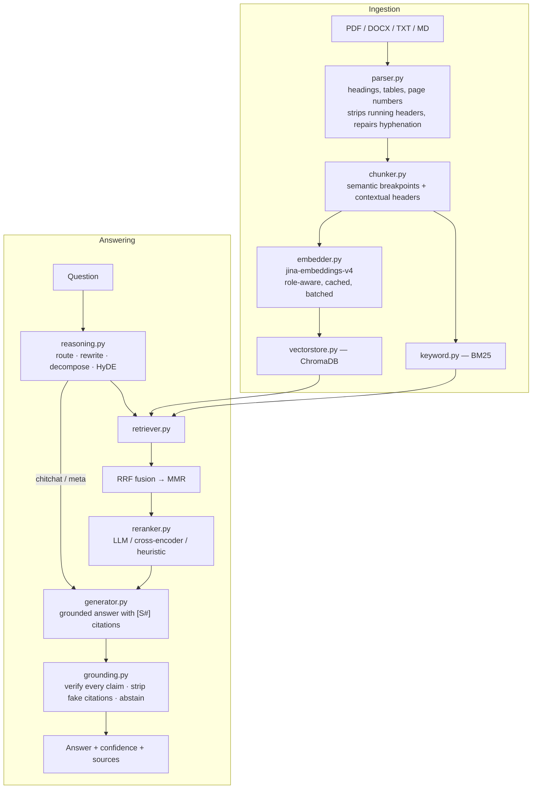

# LexoraAI

A retrieval-augmented generation system that answers questions about your documents — and, unlike most RAG demos, **verifies its own answers before showing them to you.**

Every claim it makes carries a citation back to a specific page. Claims it can't verify against a source get removed. When the documents don't contain the answer, it says so instead of inventing one.

```
Q: What does resolution VX-2291 authorise?
A: Resolution VX-2291 authorises a share buyback of up to 15 million euros [S1].
   ✅ grounded · 90% confidence · hybrid retrieval · openai/gpt-oss-20b · 3.5s
   [S1] Vertex Labs Annual Review › Governance · p.3 · dense+sparse

Q: Who is the CEO of Vertex Labs?
A: I could not verify an answer to this in your uploaded documents. The passages
   I retrieved touch on the topic but do not actually state the answer, so I
   would rather tell you that than guess.
   ⚠️ not found in sources · 15% confidence
```

---

## Documentation

A full technical overview — the problem, the architecture, every pipeline stage and the tech stack —
is in [`docs/LexoraAI-Technical-Overview.pdf`](docs/LexoraAI-Technical-Overview.pdf) (14 pages).
Regenerate it from its source with:

```bash
google-chrome --headless --no-pdf-header-footer \
  --print-to-pdf=docs/LexoraAI-Technical-Overview.pdf \
  docs/LexoraAI-Technical-Overview.html
```

---

## Measured results

Run `PYTHONPATH=. python scripts/evaluate.py` to reproduce this on the built-in labelled set (15 questions, 12 answerable and 3 deliberately unanswerable):

| Metric | Result | What it means |
|---|---|---|
| Recall@6 | **100%** | The passage containing the answer was retrieved every time |
| MRR | **1.00** | It was ranked first every time |
| Answer accuracy | **100%** | The expected fact appeared in the answer |
| Groundedness | **100%** | Every answer passed citation verification |
| Correct abstention | **100%** | All 3 unanswerable questions were declined, not hallucinated |
| Latency p50 | **~4.0 s** | End to end, including planning, retrieval, reranking and verification |

`--compare` reruns the same set against hybrid, dense-only and sparse-only retrieval so you can see what the fusion is actually buying you.

> The built-in corpus is small by design, so `precision@k` is capped by construction (7 chunks total, 6 retrieved). Point `--dataset` at your own set for a realistic precision figure.

---

## How it works



### 1. Chunking that respects meaning

Fixed-size chunking cuts sentences in half and mixes unrelated topics into one vector. This is the single biggest cause of bad retrieval, and two things fix it:

- **Semantic breakpoints.** Sentences are embedded, and a chunk boundary is placed where consecutive-sentence similarity drops below a percentile threshold — so the split lands where the topic actually changes. Headings and tables are always hard boundaries.
- **Contextual headers.** Each chunk is *embedded* with `[Document: … | Section: … | Page: N]` prepended, while the *stored* text stays clean. A chunk reading "it grew 14% year over year" becomes findable by "revenue growth", because its embedded form carries the section it lives under.

Chunks are then token-bounded — oversized ones split, undersized merged — with a sentence overlap stitched back on so no answer falls through a seam.

### 2. Hybrid retrieval

Dense vectors are great at paraphrase and bad at exact tokens. BM25 is the opposite. Ask for `STD-441` or `VX-2291` and embeddings will happily return the semantically adjacent paragraph; BM25 returns the right one.

Both run, then fuse via **Reciprocal Rank Fusion** — `score(d) = Σ 1/(k + rank)`. Rank-based fusion is robust precisely because it ignores the raw scores: a cosine of 0.71 and a BM25 of 14.2 aren't comparable, but "3rd place" and "1st place" always are. **MMR** then trades a little relevance for coverage so five near-duplicate chunks can't crowd out the one that matters.

Each arm is independently fault-tolerant: if the vector store is down, BM25 still answers, and vice versa.

### 3. Reasoning before retrieving

A raw user message is usually a poor search query — it carries pronouns that only resolve against the conversation, bundles two questions into one, and is phrased as a question while the passage answering it is phrased as a statement. One planning call fixes all of that: intent routing, decontextualisation, decomposition into sub-queries, and a **HyDE** probe (an invented answer embeds far closer to the real passage than the question does).

Two safety nets, because rewriting is the most failure-prone step in the pipeline:

- Obvious small talk is caught by a regex fast-path before any network call — greetings never trigger retrieval.
- **A rewrite can only override the user's own words when the question genuinely needs it.** "and when is it due?" contains an unresolved pronoun, so the rewrite wins. "what about expenses?" names its own subject, so the user's wording wins — even when the model tries to fuse the previous topic back in. Both phrasings are searched regardless, so a bad rewrite can never delete the terms you typed.

### 4. Grounding — the part most RAG systems skip

Telling a model "only use the context" reduces hallucination. It does not eliminate it. So the output is checked rather than trusted:

1. **Citation validity.** Every `[S#]` is parsed (including the `【S1】`, `(S2)` and `[Source 3]` variants models actually emit). Any pointing at a passage that was never in the prompt is a *fabricated citation* — the most damaging failure mode, because it looks verified — and gets stripped.
2. **Per-claim support.** The answer is split into claims and each is scored against *its own cited passages* using embedding cosine (catches paraphrase) blended with weighted lexical overlap that leans on numbers, dates and proper nouns (catches the digit-swap error embeddings miss).
3. **Optional NLI adjudication.** Borderline claims get a second opinion via `verify_with_llm: true`.
4. **Abstention.** Below the confidence floor, the answer is replaced with an honest non-answer.

Every stage fails in the safe direction: if verification itself breaks, the answer is returned unmodified and flagged `verified: false` rather than silently dropped.

### 5. Fault tolerance

| Failure | What happens |
|---|---|
| Model rate-limited (429) | Retries with exponential backoff **honouring Groq's own `retry-after` hint** |
| Model down or decommissioned | Fails over to the next model in the chain |
| Repeated LLM failures | Circuit breaker opens, calls fail fast for a cooldown, then probes |
| LLM completely unreachable | **Extractive fallback** — returns the top passages verbatim with sources. Worse than a written answer, better than a 502 |
| Query planner fails | Falls back to the raw question; quality drops, answering continues |
| Reranker fails | Degrades LLM → cross-encoder → heuristic lexical scorer |
| Embedding provider missing | Degrades Jina → fastembed → Chroma's bundled MiniLM → OpenAI |
| Jina rate-limits (429) or 5xx | Retried with exponential backoff and jitter |
| One bad input in an embedding batch | Batch is bisected so a single item can't sink the rest |
| Vector store or BM25 down | The other retrieval arm still answers |
| Embedding model changed | Fingerprint mismatch is detected and logged loudly, instead of silently poisoning retrieval — `scripts/reindex.py` re-embeds from stored chunk text |

---

## Project layout

Every stage of the pipeline is one file named after what it does.

```
LexoraAI/
├── app/
│   ├── main.py               FastAPI app, lifespan, error handling
│   ├── config.py             every knob, env-driven
│   ├── database.py           documents + chunks tables
│   ├── rag/
│   │   ├── parser.py         PDF/DOCX/TXT/MD → clean structured blocks
│   │   ├── chunker.py        blocks → semantic, context-headed chunks
│   │   ├── embedder.py       text → vectors (Jina v4, role-aware, cached, batched)
│   │   ├── vectorstore.py    dense index (ChromaDB)
│   │   ├── keyword.py        sparse index (BM25)
│   │   ├── retriever.py      hybrid search → RRF → MMR
│   │   ├── reranker.py       precision pass (LLM / cross-encoder / heuristic)
│   │   ├── reasoning.py      routing, rewriting, decomposition, HyDE
│   │   ├── generator.py      grounded answer generation
│   │   ├── grounding.py      citation validation + faithfulness scoring
│   │   ├── llm.py            Groq client: retries, fallback chain, circuit breaker
│   │   ├── prompts.py        every prompt template in one place
│   │   └── pipeline.py       orchestrates ingestion and answering
│   └── api/
│       ├── router.py         mounts everything under /api/v1
│       ├── upload.py         ingestion endpoint
│       ├── query.py          question answering endpoint
│       ├── documents.py      list / get / delete
│       └── system.py         health, deep health, stats
├── scripts/
│   ├── evaluate.py           labelled evaluation harness
│   └── reindex.py            re-embed stored chunks after a model change
├── static/index.html         web UI (no build step)
├── frontend.py               optional Gradio UI
└── tests/                    142 tests
```

---

## API

| Method | Endpoint | What it does |
|---|---|---|
| `GET` | `/api/v1/health` | Fast liveness probe |
| `GET` | `/api/v1/health/deep` | Per-component status: circuit breaker, embedder, indexes |
| `GET` | `/api/v1/stats` | Corpus size and active pipeline configuration |
| `POST` | `/api/v1/upload` | Upload PDF / DOCX / TXT / MD (up to 20 at once) |
| `POST` | `/api/v1/query` | Ask a question |
| `GET` | `/api/v1/documents` | List documents |
| `GET` | `/api/v1/documents/{id}` | One document, including live ingestion `stage` |
| `DELETE` | `/api/v1/documents/{id}` | Remove it from the DB, disk, vectors and BM25 |

A query response tells you not just the answer but how it was produced:

```jsonc
{
  "answer": "Q3 revenue was $48.2 million, growing 14.6% year over year [S1].",
  "confidence": 0.94,          // how well each claim is supported by its citation
  "grounded": true,            // every claim verified against a source
  "abstained": false,          // true when support was too weak to answer
  "degraded": false,           // true when a fallback path produced this
  "model": "openai/gpt-oss-20b",
  "plan": {
    "intent": "document_qa",
    "standalone_question": "...",   // the rewrite
    "resolved_question": "...",     // the phrasing actually used
    "search_queries": ["..."],
    "hyde_used": true
  },
  "retrieval": { "mode": "hybrid", "dense_ok": true, "sparse_ok": true, "candidates": 24 },
  "grounding": { "support_ratio": 1.0, "unsupported_claims": 0, "invalid_citations": [] },
  "trace": { "total_ms": 3529, "stages": { "plan": 401, "retrieve": 1349, "rerank": 492,
                                           "generate": 613, "verify": 373 } },
  "sources": [
    { "section": "FY24 Report › Revenue", "page_number": 1, "cited": true,
      "relevance_score": 1.0, "dense_score": 0.78, "sparse_score": 1.0,
      "rerank_score": 1.0, "retrievers": ["dense", "sparse"] }
  ]
}
```

---

## Tech stack

| Layer | Choice | Why |
|---|---|---|
| API | FastAPI | Async, auto-generated OpenAPI docs |
| LLM | **Groq `openai/gpt-oss-20b`** | Very fast inference; `gpt-oss-120b` and `qwen3.6-27b` as fallbacks |
| Embeddings | **Jina `jina-embeddings-v4`** | Multilingual, 32k context, typed query/passage tasks, Matryoshka dimensions; `bge-small` on ONNX is the offline fallback |
| Dense index | ChromaDB | Persistent, cosine ANN |
| Sparse index | rank-bm25 | Exact-token recall, rebuilt from SQL on startup |
| Reranking | Groq listwise / ONNX cross-encoder | Listwise costs no extra RAM; cross-encoder runs fully offline |
| Database | SQLite or PostgreSQL | Document metadata and the BM25 corpus |
| Parsing | PyMuPDF, python-docx | Fonts and styles drive heading detection |
| Frontend | Static HTML + optional Gradio | No build step |

> **Note on embeddings:** Groq serves chat completions only — it has no embeddings API, so embeddings come from Jina AI. Two things that model gives us and a plain encoder does not:
>
> - **Typed tasks.** Questions are embedded with `retrieval.query`, chunks with `retrieval.passage`, and grounding's claim-vs-evidence comparison with `text-matching`. Embedding a question the same way as a passage is a quiet, common cause of lost recall.
> - **Matryoshka dimensions.** The 2048-dim vector can be truncated to any prefix and stays valid, so `JINA_EMBED_DIMENSIONS=1024` halves the index for roughly 1% of retrieval quality — no model swap, no re-tuning.
>
> If `JINA_API_KEY` is absent the embedder falls back to the local ONNX `bge-small` model, so the app still runs fully offline.

---

## Getting started

```bash
git clone https://github.com/Dhanugupta0/Lexora-AI.git
cd Lexora-AI

python3 -m venv .venv && source .venv/bin/activate
pip install -r requirements.txt

cp .env.example .env
# add your GROQ_API_KEY — free at https://console.groq.com/keys
# add your JINA_API_KEY  — free at https://jina.ai/embeddings

PYTHONPATH=. uvicorn app.main:app --reload --port 8000
```

Then open **http://localhost:8000** (web UI) or **http://localhost:8000/docs** (Swagger).

Embeddings are served by the Jina API, so there is nothing to download. Without `JINA_API_KEY` the local fallback model downloads once on first use (~130 MB) and is cached afterwards.

### Docker

```bash
cp .env.example .env      # add your GROQ_API_KEY and JINA_API_KEY
docker-compose up --build -d
docker-compose logs -f api
```

Uses PostgreSQL instead of SQLite. The fallback embedding model is baked into the image, so a Jina outage costs no cold-start download.

### Tests and evaluation

```bash
PYTHONPATH=. pytest tests/ -q            # 142 tests, no API key or network needed
PYTHONPATH=. python scripts/evaluate.py  # labelled metrics (needs GROQ_API_KEY)
PYTHONPATH=. python scripts/evaluate.py --compare   # hybrid vs dense vs sparse
PYTHONPATH=. python scripts/reindex.py --drop       # re-embed after changing model
```

---

## Tuning

Everything is env-driven; see `.env.example` for the full list.

| Want to… | Change |
|---|---|
| Retrieve more context | `DEFAULT_TOP_K=10`, `CANDIDATE_POOL=60` |
| Use larger chunks | `CHUNK_SIZE_TOKENS=768`, `CHUNK_OVERLAP_TOKENS=96` |
| Favour diversity over relevance | `MMR_LAMBDA=0.4` |
| Rerank fully offline | `RERANKER_MODE=cross_encoder` (needs ~90 MB more RAM) |
| Be stricter about hallucination | `GROUNDING_MIN_SUPPORT=0.55`, `ABSTAIN_THRESHOLD=0.4` |
| Cut latency and LLM calls | `ENABLE_QUERY_PLANNING=False`, `RERANKER_MODE=heuristic` |
| Search exact terms only | `RETRIEVAL_MODE=sparse` |

**On Groq's free tier** the pipeline makes up to four LLM calls per question (plan → rerank → answer → optional verify), which can brush the 8,000 tokens-per-minute limit. The retry and fallback logic handles this transparently, but setting `ENABLE_QUERY_PLANNING=False` and `RERANKER_MODE=heuristic` cuts it to a single call if you'd rather avoid the backoff.

---

## Deploying to Render

1. Push to GitHub, then **New → Blueprint** in the [Render dashboard](https://dashboard.render.com/) — `render.yaml` configures everything.
2. Add `GROQ_API_KEY` when prompted.
3. Optionally attach a 1 GB persistent disk at `/data` so documents survive redeploys.

Free-tier instances sleep after 15 minutes idle; the first request back takes ~30 s. Keep `RERANKER_MODE=llm` there — the cross-encoder needs memory the free tier doesn't have.

---

**Built by Dhanu Gupta**
