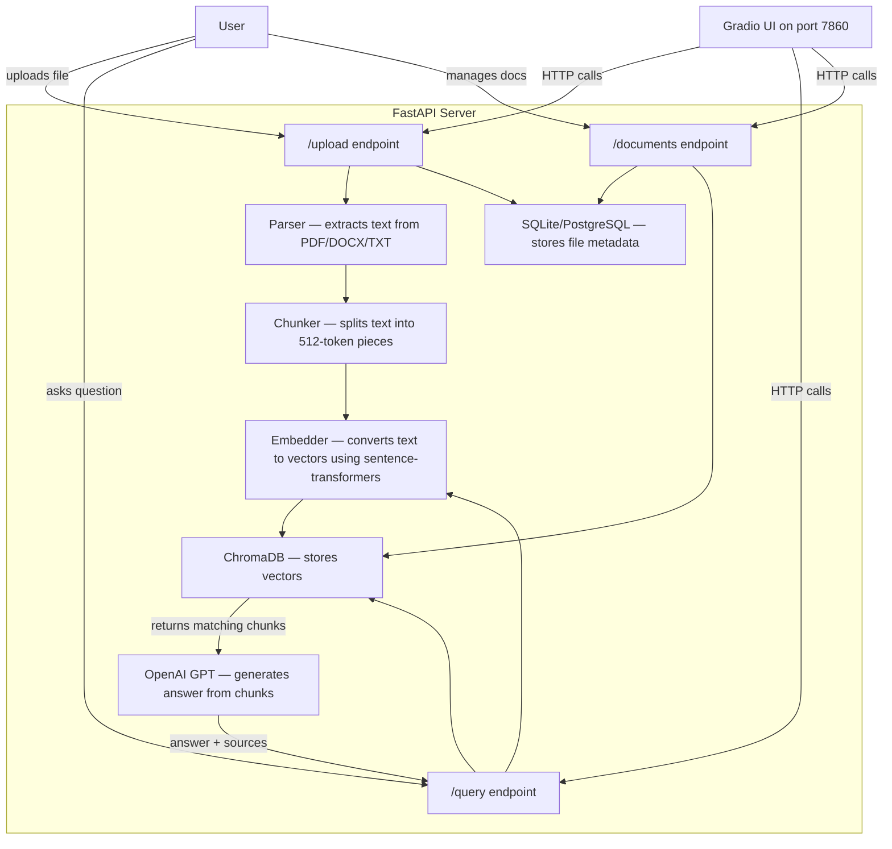

# LexoraAI

A RAG (Retrieval-Augmented Generation) system where you upload documents and ask questions about them. The system finds relevant parts from your documents and uses OpenAI to generate an answer based only on that content — so it doesn't make things up.

---

## How It Works (Simple Version)

```
You upload a PDF/DOCX/TXT
    → Text is extracted from the file
    → Text is split into small chunks
    → Each chunk is converted into a vector (embedding)
    → Vectors are stored in ChromaDB

You ask a question
    → Your question is converted into a vector
    → ChromaDB finds the most similar chunks
    → Those chunks + your question are sent to OpenAI
    → You get an answer with source references
```

---

## Architecture



This is the entire system. The FastAPI server handles everything — parsing, chunking, embedding, storing, searching, and generating answers. Gradio is just a frontend that talks to the API over HTTP.

---

## File Structure

```
LexoraAI/
├── app/                        # All backend code lives here
│   ├── config.py               # Loads settings from .env (API keys, paths, etc.)
│   ├── database.py             # Database setup — tables, connection, models
│   ├── main.py                 # Entry point — creates the FastAPI app
│   ├── pipeline.py             # The core logic — parsing, chunking, embedding, search, answer generation
│   └── api/
│       ├── router.py           # Groups all API routes under /api/v1
│       ├── upload.py           # Handles file uploads and triggers processing
│       ├── query.py            # Takes a question, runs the RAG pipeline, returns answer
│       └── documents.py        # List, get, or delete uploaded documents
│
├── tests/
│   └── test_pipeline.py        # 21 tests — covers parser, chunker, embedder, and API
│
├── frontend.py                 # Gradio web UI — chat interface + document management
├── requirements.txt            # Python packages needed
├── Dockerfile                  # Builds the API into a Docker container
├── docker-compose.yml          # Runs PostgreSQL + API together with Docker
├── .env.example                # Template — copy to .env and add your OpenAI key
├── postman_collection.json     # Import into Postman to test all API endpoints
├── pytest.ini                  # Test config
└── README.md
```

**What each key file does:**

- **`pipeline.py`** — This is the most important file. It has all the RAG logic: parsing documents, splitting into chunks, creating embeddings, storing in ChromaDB, searching, and calling OpenAI to generate answers.
- **`database.py`** — Sets up SQLite (local) or PostgreSQL (Docker) to store document metadata like filename, status, upload time, etc.
- **`config.py`** — Reads `.env` file and makes settings available to the rest of the app.
- **`main.py`** — Creates the FastAPI app, sets up CORS, and connects everything on startup.
- **`frontend.py`** — A Gradio app that gives you a web UI to upload files and ask questions instead of using the API directly.

---

## API Endpoints

| Method | Endpoint | What it does |
|--------|----------|-------------|
| `GET` | `/api/v1/health` | Check if server is running |
| `POST` | `/api/v1/upload` | Upload PDF/DOCX/TXT files (up to 20 at once) |
| `POST` | `/api/v1/query` | Ask a question, get an answer with sources |
| `GET` | `/api/v1/documents` | List all uploaded documents |
| `GET` | `/api/v1/documents/{id}` | Get details of one document |
| `DELETE` | `/api/v1/documents/{id}` | Delete a document from everywhere |

---

## Tech Stack

| What | Tool | Why |
|------|------|-----|
| API | FastAPI | Fast, async, auto-generates docs |
| Database | SQLite (local) / PostgreSQL (Docker) | Stores document metadata |
| Vector store | ChromaDB | Stores and searches embeddings |
| Embeddings | Sentence-Transformers (all-MiniLM-L6-v2) | Runs locally, no API key needed |
| LLM | OpenAI GPT-4o-mini | Generates answers from retrieved chunks |
| Doc parsing | PyMuPDF, python-docx | Reads PDF and DOCX files |
| Tokenizer | tiktoken | Counts tokens for chunking |
| Frontend | Gradio | Simple web UI |
| Tests | pytest | 21 tests, all passing |

---

## Configuration

All settings come from the `.env` file. Copy `.env.example` to `.env` and fill in your values:

| Variable | Default | What it is |
|----------|---------|-----------|
| `OPENAI_API_KEY` | — | **Required.** Your OpenAI key for answer generation |
| `DATABASE_URL` | `sqlite:///./local_data/lexora.db` | Database connection string |
| `CHROMA_PATH` | `./local_data/chroma` | Where ChromaDB stores vectors |
| `UPLOAD_DIR` | `./local_data/uploads` | Where uploaded files are saved |
| `EMBEDDING_MODEL` | `all-MiniLM-L6-v2` | Which embedding model to use |
| `OPENAI_MODEL` | `gpt-4o-mini` | Which OpenAI model to use |
| `CHUNK_SIZE_TOKENS` | `512` | Tokens per chunk |
| `CHUNK_OVERLAP_TOKENS` | `50` | Overlap between chunks |
| `DEFAULT_TOP_K` | `5` | How many chunks to retrieve per query |

---

## Getting Started

### Clone the repo

```bash
git clone https://github.com/Dhanugupta0/Lexora-AI.git
cd Lexora-AI
```

### Local Setup

```bash
# Create virtual environment
python3 -m venv .venv
source .venv/bin/activate

# Install dependencies
pip install -r requirements.txt

# Set up environment
cp .env.example .env
# Open .env and add your OPENAI_API_KEY

# Start the API server
PYTHONPATH=. uvicorn app.main:app --host 0.0.0.0 --port 8000 --reload

# In a second terminal — start the Gradio frontend
PYTHONPATH=. python frontend.py
```

### Docker Setup

```bash
cp .env.example .env
# Add your OPENAI_API_KEY in .env

docker-compose up --build -d

# Check logs
docker-compose logs -f api
```

Docker uses PostgreSQL instead of SQLite. Everything else stays the same.

### Running Tests

```bash
PYTHONPATH=. pytest tests/ -v
# Expected: 21 passed
```

---

## How to Access

Once the server is running:

| What | URL |
|------|-----|
| **Gradio UI** (upload files, ask questions) | http://localhost:7860 |
| **API Docs** (Swagger — try endpoints directly) | http://localhost:8000/docs |
| **Health Check** | http://localhost:8000/api/v1/health |

Open http://localhost:7860 in your browser to start using the app. Upload a document, wait for it to process, then ask questions about it.

---

**Built by Dhanu Gupta**
